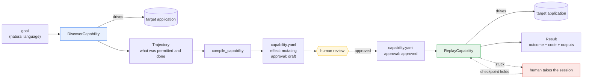
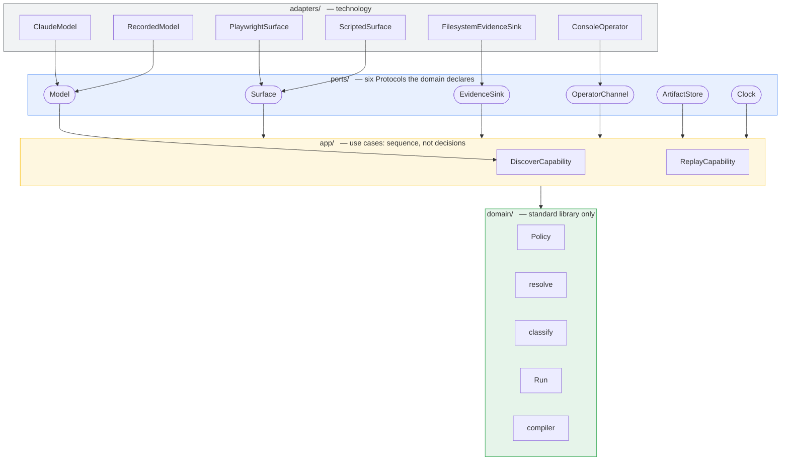

# computer-use-automation

Turns legacy UI flows into callable, replayable capabilities, so an AI agent can
operate bank software that offers no API.

**Discovery** runs an LLM loop once against a live interface and records the
procedure it found. **Replay** executes that recorded procedure with no model in
the loop, as many times a day as the agent needs it.

The split is not about cost or latency. It is that you cannot audit a decision
that has not been made yet. The artifact moves the decision from runtime to
review time, where a person approves it once and an auditor can read it
afterwards.

- **Design write-up:** [REPORT.md](REPORT.md)
- **Recorded runs:** [evidence/](evidence/README.md) — three model-driven
  discovery runs, three replays, and a handover performed by a person

---

## How it fits together

A goal becomes an artifact once. The artifact is reviewed once. After that every
invocation is deterministic replay, and the model is not in the loop.



The model appears exactly once, on the left. `ReplayCapability` has no `Model`
in its dependency graph, so that separation is a property of the wiring rather
than a rule anyone has to remember.

## Architecture

Hexagonal — ports and adapters, with the dependency arrow pointing inward.
Adapters depend on ports; ports are declared by the domain; the domain depends
on nothing but the standard library.



`Model` connects only to `DiscoverCapability`. `Policy` is deliberately not a
port — making the safety rules substitutable would allow a permissive
implementation to be wired in by accident.

---

## Requirements

| | |
|---|---|
| Python | 3.11 or later |
| Browser | Chromium, installed via Playwright |
| Model access | Anthropic API key — **discovery only** |

## Installation

```bash
python3 -m venv .venv
.venv/bin/pip install -e ".[dev]"
.venv/bin/playwright install chromium

cp .env.example .env
```

## Configuration

Two files, with different jobs.

**`.env`** holds credentials and is not committed:

| Variable | Required for | Notes |
|---|---|---|
| `TARGET_APP_PASSWORD` | anything that signs on | no default; the target application refuses to start without it |
| `TARGET_APP_USER` | anything that signs on | defaults to `tmiller` |
| `ANTHROPIC_API_KEY` | discovery only | replay constructs no model and cannot reach one |

**`config.yaml`** holds everything else and is committed: the surface, the model
name, the discovery bounds, the policy allowlists and the redaction rules. It is
validated at startup, so a mistake in it is reported with the offending field
named rather than surfacing three layers down mid-run.

## The target application

This repository contains no connection to a real banking system, and should not
be pointed at one. The automation target is a Flask application in
[`target_app/`](target_app/), written to be difficult in the ways production
systems are: nested layout tables, generated ASP.NET-style control identifiers,
two buttons both labelled "Search", and a session that expires by re-rendering
the sign-on form at the route of the page it replaced while returning HTTP 200.

It is started in-process on a free port by every command below. No separate
server to run.

---

## Quick start

Replay a capability against the target application:

```bash
.venv/bin/python -m cua.cli replay \
  --artifact evidence/discovery/capability.yaml \
  --input member_id=100045 \
  --approve
```

```
outcome : success
outputs :
  savings_balance = 4820.55
  account_name = Test Member One
```

No API key required. The same artifact serves any member, because it is
parameterised rather than recorded:

```bash
.venv/bin/python -m cua.cli replay --artifact evidence/discovery/capability.yaml \
  --input member_id=100046 --approve
# savings_balance = 12.40, account_name = Test Member Two
```

Omitting `--approve` refuses the run before the application is touched. A
capability produced by a model has not been reviewed by anyone, and approval is
the record that somebody did.

**Exit codes**

| Code | Meaning |
|---|---|
| `0` | success |
| `3` | a known business outcome — the run worked, the answer was no |
| `4` | a person is required |
| `1` | failure |

---

## Full demo path

### 1. Discovery

```bash
export ANTHROPIC_API_KEY=...
.venv/bin/python scripts/discover.py
```

A browser window opens. The script signs on, standing in for the operator who
would do so in production, and hands the authenticated session to the model. The
model is given a goal and drives the interface.

Output in `evidence/discovery/`:

| File | Contents |
|---|---|
| `discovery_run.jsonl` | proposals, rationales, policy checks, actions, observations — redacted on write |
| `transcript.json` | the raw model exchange, masked |
| `capability.yaml` | the compiled artifact |

Two further scenarios, both of which stop rather than succeed:

```bash
.venv/bin/python scripts/discover.py --member 100099 --run-id not_found
.venv/bin/python scripts/discover.py --signed-out --run-id signed_out
```

### 2. Replay

Uses the artifact discovery just produced. See [Quick start](#quick-start).

```bash
.venv/bin/python scripts/replay_demo.py
```

Runs three replays and writes each to `evidence/`: the compiled artifact against
a member who exists, the same artifact against one who does not, and the
reviewed artifact against that same screen. The last two return different
answers to an identical situation, which is what the approval state exists to
capture.

### 3. Handover

```bash
.venv/bin/python scripts/handoff.py
```

A replay begins on a healthy session; the session is expired underneath it
mid-run. The run stops, writes an intervention request, and hands you the
browser.

1. Sign on in the browser window it gives you.
2. Return to the terminal and press Enter.

The run re-observes, confirms the condition that stopped it no longer holds, and
completes. Pressing Enter without signing on stops the run instead — a person
saying they are finished is a claim about the person, not about the application.

---

## Development

The full suite runs offline: no API key, no network, no real credentials.

```bash
.venv/bin/pytest                      # 256 tests
.venv/bin/mypy src target_app tests   # strict
.venv/bin/ruff check .
```

Observe any browser-based test:

```bash
CUA_HEADLESS=0 CUA_SLOW_MO=400 .venv/bin/pytest tests/integration/test_replay_live.py -k success
```

The offline suite includes a complete discovery run driven by
[`RecordedModel`](src/cua/adapters/recorded_model.py), which replays decisions a
real model made. It exercises the loop, the policy checks and the compiler. It
establishes nothing about whether a model can navigate a screen it has not seen;
only a live run does that, and `evidence/` contains one.

## Project layout

```
src/cua/domain/          business rules — standard library only, no I/O
src/cua/ports/           the six interfaces the domain declares
src/cua/adapters/        technology: browser, model SDK, filesystem, console
src/cua/app/             use cases — sequence, not decisions
src/cua/composition.py   the only module permitted to import adapters
src/cua/cli.py           argument parsing and exit codes

target_app/              the legacy application under automation
evidence/                recorded runs
scripts/                 the operations requiring a person to be present
```

The dependency arrow points inward and is enforced by test. Nothing under
`domain/` imports outside the standard library; CI verifies this by importing
every domain module into a virtual environment with no packages installed.

## Licence

Written as a take-home exercise. No licence granted.
